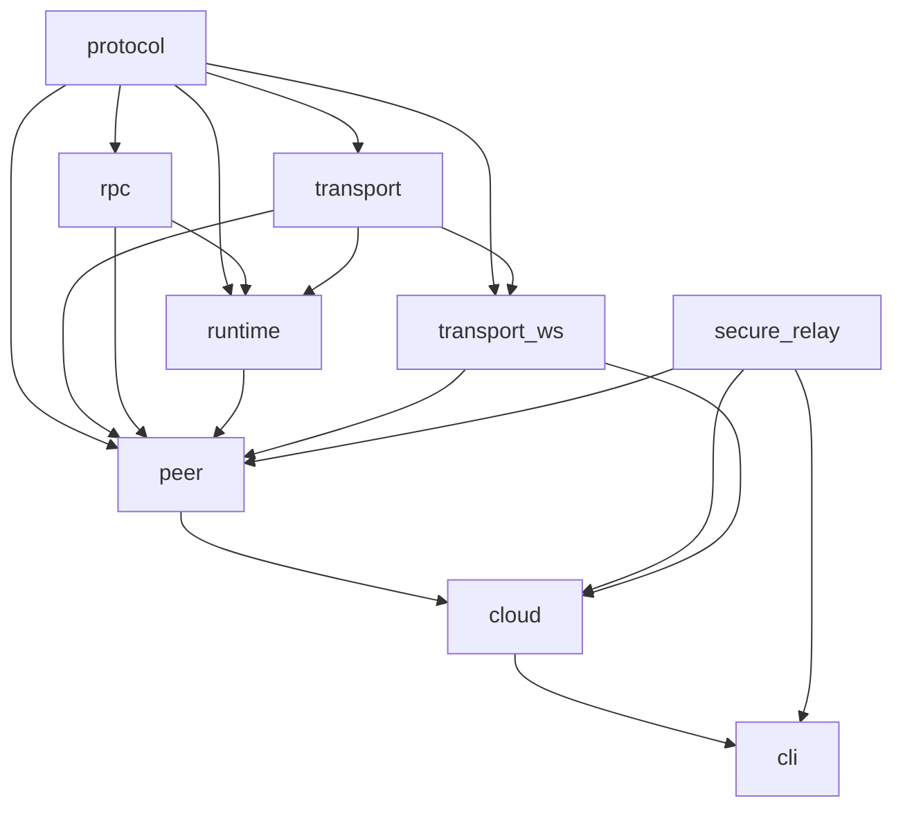

# Project Structure

What lives where, who depends on whom, and where to start.

## Layout

```text
.
├─ docs/                   # ADRs, specs, architecture notes
├─ examples/               # Usage samples (when present)
├─ packages/               # Implementation code
│  ├─ protocol/
│  ├─ transport/
│  ├─ runtime/
│  ├─ rpc/
│  ├─ peer/
│  ├─ secure-relay/        # E2EE relay protocol (SBRP)
│  ├─ testing/             # Test helpers
│  ├─ transport-ws/        # WebSocket transport (browser + Node/Bun)
│  ├─ cloud/               # relay.sideband.cloud integration
│  └─ cli/                 # Daemon CLI (npx sideband)
├─ README.md               # Top-level overview
├─ package.json            # Workspace root
├─ tsconfig.base.json      # Shared TS options
└─ tsconfig.json           # Root project config
```

Optional root files (not shown): AI helper notes (`CLAUDE.md`), lockfiles (`bun.lock`), lint/format configs.

## Package roles and boundaries

`@sideband/protocol` — Sideband Protocol (SBP)
• Canonical message/frame types, constants, error codes; light encode/decode helpers.
• No I/O or runtime logic. Topology-agnostic (used by both relay and direct modes).
• Depends on: none. Used by: all.

`@sideband/transport` — Transport ABI + shared utilities\
• Defines the `Transport` interface and common transport types/utilities (e.g., reconnect/backoff helpers, optional loopback transport).\
• No environment-specific code.\
• Depends on: protocol. Used by: runtime, testing, all concrete transports.

`@sideband/runtime` — Transport-agnostic runtime
• Manages peers, attaches transports, decodes frames, routes messages, correlates requests/responses, middleware hooks.
• No concrete transport or UI/framework code.
• Depends on: protocol, transport, rpc. Must not depend on concrete transports/cli.

`@sideband/rpc` — Typed RPC envelope layer
• Maps method names to input/output shapes; request/response/notification helpers and JSON codec.
• Depends on: protocol. No transport coupling.

`@sideband/peer` — Peer SDK
• Friendly API over runtime + injected or default transport; lifecycle utilities; convenience pub/sub/RPC helpers.
• Depends on: protocol, rpc, runtime, transport, transport-\* (as chosen). Optional peer dependency: secure-relay.
• No protocol definitions or low-level routing.

`@sideband/transport-ws` — WebSocket transport
• Implements the Transport interface via WebSocket for both browser and Node/Bun.
• Conditional exports: `./browser` for browsers, `./node` for Node/Bun server-side.
• Depends on: protocol, transport. Must not depend on runtime/rpc/peer.

`@sideband/secure-relay` — Sideband Relay Protocol (SBRP)
• E2EE handshake, session encryption/decryption, TOFU identity pinning, replay protection.
• Enables secure browser↔daemon communication via untrusted relay servers.
• Standalone cryptographic layer; no I/O or transport code.
• Depends on: none (uses @noble/\* for crypto). Used by: relay implementations, browser/daemon apps.

`@sideband/cloud` — relay.sideband.cloud integration
• `connect()` (client) and `listen()` (daemon). `listen()` returns `CloudPeerServer` with `daemonId`, `relayUrl`, and `createQuickConnect()` for zero-infrastructure Quick Connect URLs.
• Depends on: peer, secure-relay, transport-ws.

`sideband` — Daemon CLI
• `npx sideband` starts a relay-connected daemon and prints a Quick Connect URL. Wraps `@sideband/cloud`'s `listen()`.
• Depends on: cloud, secure-relay; does not define protocol or runtime behavior.

`@sideband/testing` — Test scaffolding\
• Central place for fakes, loopback transports, peer fixtures, and shared test helpers.\
• Keeps test utilities out of runtime packages; avoids circular devDeps.\
• Depends on: protocol, transport, and runtime packages as needed. Only imported from tests (never production paths).

Dependency flow (allowed edges only):



## Dependency policy

* **`dependencies`** — anything your published JS imports at runtime. All internal `@sideband/*` imports go here. Each package must be installable in isolation without consumers manually wiring internal pieces.
* **`peerDependencies`** — only for host-provided integrations or optional feature adapters the consumer chooses to install (e.g., `@sideband/secure-relay` in peer).
* Never use peer dependencies just to deduplicate installs across the monorepo; package managers already deduplicate compatible `^` ranges.

## Conventions

* Language: TypeScript; ESM (`type: "module"`).
* Each package has its own `package.json` and `tsconfig.json` extending `tsconfig.base.json`.
* Tests/config/docs live with the package they describe.
* Keep new code within the package that owns the responsibility above; update this file when roles or dependencies change.
