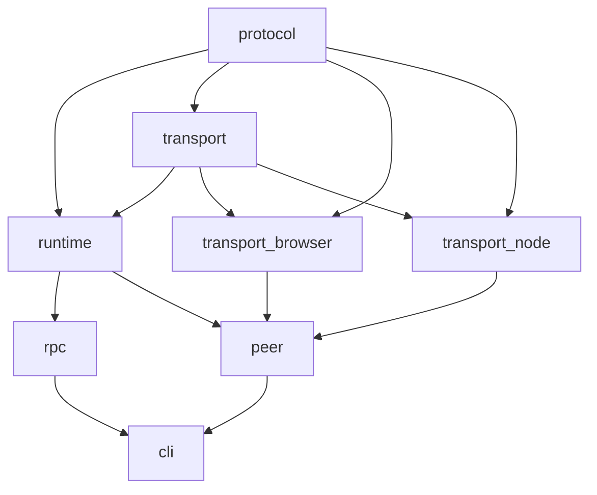

# Project Structure

What lives where, who depends on whom, and where to start.

## Layout

```text
.
├─ docs/                   # ADRs, specs, architecture notes
├─ examples/               # Usage samples (when present)
├─ packages/               # Implementation code
│  ├─ protocol/
│  ├─ transport/
│  ├─ runtime/
│  ├─ rpc/
│  ├─ peer/
│  ├─ testing/             # Test helpers (when added)
│  ├─ transport-browser/
│  ├─ transport-node/
│  └─ cli/
├─ README.md               # Top-level overview
├─ package.json            # Workspace root
├─ tsconfig.base.json      # Shared TS options
└─ tsconfig.json           # Root project config
```

Optional root files (not shown): AI helper notes (`CLAUDE.md`), lockfiles (`bun.lock`), lint/format configs.

## Package roles and boundaries

`@sideband/protocol` — Wire contract  
• Canonical message/frame types, constants, error codes; light encode/decode helpers.  
• No I/O or runtime logic.  
• Depends on: none. Used by: all.

`@sideband/transport` — Transport ABI + shared utilities  
• Defines the `Transport` interface and common transport types/utilities (e.g., reconnect/backoff helpers, optional loopback transport).  
• No environment-specific code.  
• Depends on: protocol. Used by: runtime, testing, all concrete transports.

`@sideband/runtime` — Transport-agnostic runtime
• Manages peers, attaches transports, decodes frames, routes messages, correlates requests/responses, middleware hooks.
• No concrete transport or UI/framework code.
• Depends on: protocol, transport. Must not depend on concrete transports/cli.

`@sideband/rpc` — Typed RPC on top of runtime
• Maps method names to input/output shapes; client/server helpers; reuses runtime correlation/timeouts.
• Depends on: protocol, runtime. No transport coupling.

`@sideband/peer` — Peer SDK
• Friendly API over runtime + injected or default transport; lifecycle utilities; convenience pub/sub/RPC helpers.
• Depends on: protocol, runtime, transport-\* (as chosen). No protocol definitions or low-level routing.

`@sideband/transport-browser` — Browser transport  
• Implements the Transport interface via browser primitives (e.g., WebSocket); may handle reconnects/errors.  
• Depends on: protocol, transport. Must not depend on runtime/rpc/peer.

`@sideband/transport-node` — Node/Bun transport  
• Transport interface via Node/Bun networking (e.g., ws/Bun WS); server/client wiring.  
• Depends on: protocol, transport. Must not depend on runtime/rpc/peer.

`@sideband/cli` — Developer tooling  
• Commands for scaffolding, inspection, debugging, admin. Logic should reuse existing packages.  
• Depends on: any package as needed; does not define protocol/runtime behavior itself.

`@sideband/testing` — Test scaffolding (planned)  
• Central place for fakes, loopback transports, peer fixtures, and shared test helpers.  
• Keeps test utilities out of runtime packages; avoids circular devDeps.  
• Depends on: protocol, transport, and runtime packages as needed. Only imported from tests (never production paths).

Dependency flow (allowed edges only):



## Conventions

- Language: TypeScript; ESM (`type: "module"`).
- Each package has its own `package.json` and `tsconfig.json` extending `tsconfig.base.json`.
- Tests/config/docs live with the package they describe.
- Keep new code within the package that owns the responsibility above; update this file when roles or dependencies change.
