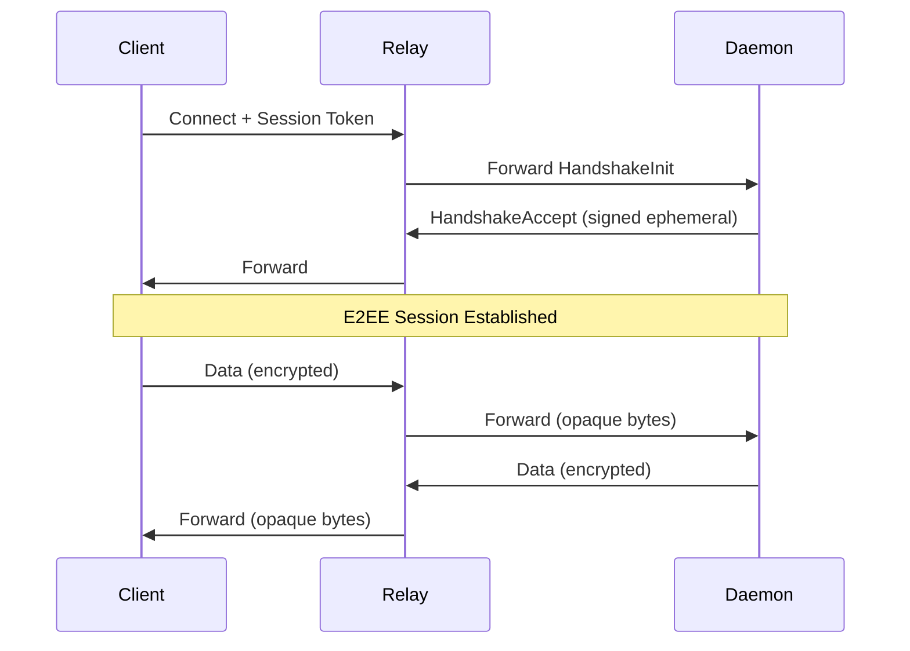

# Sideband Relay Protocol (SBRP)

**Version:** 0.1.0\
**Status:** Draft

> **Authority**: Navigation (Non-normative)\
> **Purpose**: Overview, intent, roles, and navigation to normative documents.

## Overview

SBRP enables secure communication between local daemons and browser-based UIs via a relay server. The protocol uses a hybrid trust model:

* **Relay is trusted** for token validation, access enforcement, and routing
* **Relay cannot decrypt** application payloads (end-to-end encrypted)
* **Relay cannot perform undetectable MITM** on established TOFU pins

This provides persistent multi-device access while ensuring message confidentiality.

```text
┌─────────┐         ┌─────────┐         ┌─────────┐
│ Browser │◄──TLS──►│  Relay  │◄──TLS──►│ Daemon  │
│         │  auth   │ Server  │  auth   │         │
└─────────┘         └─────────┘         └─────────┘
     │                   │                   │
     │      [auth, routing, presence]        │
     │                   │                   │
     └────────── E2EE encrypted ─────────────┘
           [signed handshake, encrypted payloads]
```

### Design Goals

* Persistent access from any device
* Multi-device support (mobile, desktop, multiple browsers)
* End-to-end encryption for application data
* Cryptographic MITM protection (not just trust-based)
* Standard OAuth/session authentication
* Zero local TLS/certificate configuration

### Non-Goals

* Protecting against compromised relay (auth/routing layer)
* Transport-level anonymity
* Hiding metadata (timing, message size, which daemon you're connecting to)

## Terminology

**Client**: Session initiator authenticated via control plane. Generates ephemeral X25519 keys per session. No persistent cryptographic identity. Verifies daemon via TOFU. May be a browser, CLI, native app, or any non-daemon participant.

**Daemon**: Long-lived agent with Ed25519 identity keypair. Registers with control plane via API key; connects to relay using presence tokens. Reachable only through relay.

**Relay**: Routing authority and token validator. Not an encryption endpoint. Does not authenticate directly; validates tokens issued by control plane.

## Trust Model

SBRP uses a layered trust model where the relay handles authentication and routing while being cryptographically excluded from message content.

| What Relay Can Do                  | What Relay Cannot Do                       |
| ---------------------------------- | ------------------------------------------ |
| Validate tokens from control plane | Decrypt message content (E2EE)             |
| Route connections between parties  | Perform undetectable MITM after TOFU trust |
| See metadata (timing, size)        | Forge daemon identity (Ed25519 signatures) |
| Drop or delay messages (DoS)       | —                                          |

**TOFU Identity Pinning**: Clients persist daemon identity public keys locally. First connection trusts the control-plane-provided key; subsequent connections verify against the pinned key. Key changes abort the connection and require user approval.

See [threat-model.md](./threat-model.md) for detailed threat analysis and attack resistance.

## Protocol Flow

### Daemon Registration (One-Time)

Daemon generates Ed25519 identity keypair on first run and registers with control plane.

```text
Daemon                           Control Plane                    Relay
   │                                  │                              │
   │── POST /api/daemons/register ───►│                              │
   │   { apiKey, identityPublicKey }  │                              │
   │◄─── 200 { daemonId, presenceToken }                             │
   │                                  │                              │
   │── WSS /relay?token=<jwt> ────────┼─────────────────────────────►│
```

### Client Connection

Client lists available daemons, obtains session token, and connects.

```text
Client                           Control Plane                    Relay
   │                                  │                              │
   │── GET /api/daemons ─────────────►│                              │
   │◄─── 200 [{ id, identityPublicKey, status }]                     │
   │                                  │                              │
   │── POST /api/sessions ───────────►│                              │
   │   { daemonId }                   │                              │
   │◄─── 200 { relayUrl, token }──────│                              │
   │                                  │                              │
   │── WSS /relay?token=<jwt> ────────┼─────────────────────────────►│
```

### E2EE Handshake

After WebSocket connection, client and daemon perform authenticated key exchange.

```text
Client                     Relay                    Daemon
   │                         │                         │
   │── HandshakeInit (0x01) ►│── forward ─────────────►│
   │   [32B X25519 key]      │                         │
   │                         │                         │  Generate ephemeral
   │                         │                         │  Sign with Ed25519
   │◄───────────────────────────── HandshakeAccept (0x02)
   │                         │   [32B key + 64B sig]   │
   │  Verify signature       │                         │
   │  Derive session keys    │                         │
   │◄══════════ Encrypted frames (0x03) ══════════════►│
```

See [cryptography-and-wire.md](./cryptography-and-wire.md) for signature construction, key derivation, and wire format details.

## End-to-End Flow

### Happy Path Walkthrough

1. Daemon registers with control plane, stores Ed25519 identity keypair
2. Client authenticates, obtains session token targeting daemon
3. Client connects to relay, sends HandshakeInit with ephemeral X25519 key
4. Daemon signs its ephemeral key with identity key, sends HandshakeAccept
5. Client verifies signature against pinned identity (TOFU)
6. Both derive session keys via HKDF with transcript hash
7. Encrypted messages flow through relay as opaque bytes



### Failure Path: Session Interruption

1. Daemon disconnects (network issue, process restart)
2. Relay sends `Control(session_paused)` to client
3. Client suspends sends, shows UI indicator
4. If daemon reconnects within grace period:
   * Daemon sends `Signal(ready)` for sessions with retained state
   * Relay sends `Control(session_resumed)` to client
5. If state is lost or grace expires:
   * Relay sends `Control(session_expired)` to client
   * Client initiates full reconnect with new handshake

See [state-machine.md](./state-machine.md) for complete state transition rules.

## Message Categories

| Category  | Frame Type | Direction        | Purpose                       |
| --------- | ---------- | ---------------- | ----------------------------- |
| Endpoint  | 0x01–0x03  | E2EE             | Handshake and encrypted data  |
| Signal    | 0x04       | Daemon → Relay   | Session lifecycle commands    |
| Control   | 0x20       | Relay → Endpoint | Notifications and errors      |
| Keepalive | 0x10–0x11  | Either           | Connection liveness detection |

**Endpoint frames** participate in E2EE and are forwarded by relay without inspection. **Signal frames** are daemon-to-relay commands (ready, close). **Control frames** are relay-generated notifications (session\_paused, rate\_limited). **Keepalive frames** are connection-scoped and never forwarded.

See [cryptography-and-wire.md](./cryptography-and-wire.md) for wire format details.

## Relay Server Responsibilities

The relay operates as a frame router with these core responsibilities:

| Responsibility     | Description                                            |
| ------------------ | ------------------------------------------------------ |
| Token validation   | Validate JWTs from control plane; enforce claims       |
| Routing            | Route session-bound frames between paired connections  |
| Presence tracking  | Track daemon online/offline; notify clients of changes |
| Rate limiting      | Enforce message rate and payload size limits           |
| Keepalive handling | Respond to Ping with Pong; detect dead connections     |

The relay MUST NOT interpret encrypted payloads or derive information from their content.

See [authentication.md](./authentication.md) for token validation details.

## Reconnection

### Daemon Reconnection

Daemons may reconnect within a grace period and resume sessions if state is retained:

* **State retained**: Daemon sends `Signal(ready)` → Client receives `session_resumed`
* **State lost**: Daemon sends `Signal(close)` → Client receives `session_expired`
* **Non-resumable daemons**: Relay auto-expires all sessions on reconnect

### Client Reconnection

Clients always perform a full reconnect:

1. Obtain new session token from control plane
2. Connect to relay with fresh token
3. Full E2EE handshake (new ephemeral keys)

See [state-machine.md](./state-machine.md) for state transition details.

## Multi-Device Support

* Each client has an independent E2EE session with the daemon
* Daemon maintains separate key state per client (keyed by SessionID)
* Messages are not broadcast; each client gets its own responses
* Identity pinning is per client/device storage (not synced)

## Security Properties

| Property                | Mechanism                         |
| ----------------------- | --------------------------------- |
| Message confidentiality | ChaCha20-Poly1305 E2EE            |
| Message integrity       | Poly1305 authentication tag       |
| Daemon authenticity     | Ed25519 identity signatures       |
| Forward secrecy         | Ephemeral X25519 per session      |
| Replay protection       | Sequence numbers + sliding window |
| MITM detection          | TOFU identity pinning             |

See [threat-model.md](./threat-model.md) for attack resistance analysis.

## Delegation

**This protocol delegates:**

* **Wire format**: Defines own binary framing (does not use SBP frames directly)
* **Error codes**: Defines own Control code taxonomy
* **Application protocol**: Encrypted payloads contain SBP frames

**This protocol defines:**

* **E2EE session**: Handshake, key derivation, encrypted transport
* **Control codes**: Relay-to-endpoint notifications
* **Signal codes**: Daemon-to-relay lifecycle commands
* **Authentication**: Token-based relay access

## Document Authority

| Concern                | Primary                                                | Supporting                                       |
| ---------------------- | ------------------------------------------------------ | ------------------------------------------------ |
| Crypto + wire format   | [cryptography-and-wire.md](./cryptography-and-wire.md) | —                                                |
| State transitions      | [state-machine.md](./state-machine.md)                 | —                                                |
| Control code semantics | [state-machine.md](./state-machine.md)                 | [control-codes.md](./control-codes.md)           |
| Control code values    | [control-codes.md](./control-codes.md)                 | —                                                |
| Authentication         | [authentication.md](./authentication.md)               | —                                                |
| Threat model           | [threat-model.md](./threat-model.md)                   | —                                                |
| Test specification     | [conformance.md](./conformance.md)                     | —                                                |
| Security verification  | cryptography-and-wire.md, state-machine.md             | [security-checklist.md](./security-checklist.md) |

## Local Terminology

| Term           | Definition                               | See also                                      |
| -------------- | ---------------------------------------- | --------------------------------------------- |
| Session Key    | Derived HKDF key for this connection     | [glossary](../glossary.md#session-key)        |
| TOFU           | Trust-on-first-use identity pinning      | [glossary](../glossary.md#tofu)               |
| Control Frame  | Relay-generated notification (0x20)      | [glossary](../glossary.md#control-frame-sbrp) |
| Signal Frame   | Daemon-to-relay lifecycle command (0x04) | —                                             |
| Endpoint Frame | Session-bound E2EE frame (0x01–0x03)     | —                                             |

## Recommended Reading Order

1. **index.md** (this document) — overview and navigation
2. **[cryptography-and-wire.md](./cryptography-and-wire.md)** — crypto invariants + wire format
3. **[state-machine.md](./state-machine.md)** — lifecycle and control semantics
4. **[control-codes.md](./control-codes.md)** — code catalog
5. **[authentication.md](./authentication.md)** — token validation
6. **[conformance.md](./conformance.md)** — what must pass

## Related Documents

* [Protocol Architecture](../architecture.md): Layer stack, wrapping rules
* [Glossary](../glossary.md): Shared terminology
* ADR-002: Naming matrix (SBRP abbreviation)
